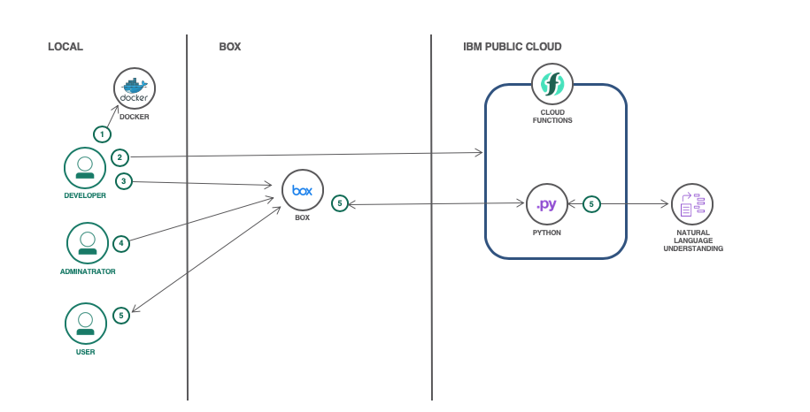

# Document enrichment using Watson Natural Language Understanding with Box Custom Skills

In this code pattern, we will create a simple and powerful Box Custom Skill powered by the [IBM Watson Natural Language Understanding service](https://www.ibm.com/watson/services/natural-language-understanding/). This capability will allow you to gain AI insights from a .docx file that is uploaded to a Box to make it more searchable and consumable to enhance and automate your business process. Your file will be enriched by Watson with metadata, such as concepts and keywords, that are relevant to the content of your document. This metadata is then attached to the original file in Box and displayed visually as a Skills "card".

> **Important Note:** This code is being provided AS-IS for evaluation purposes and is not a production solution. Many additional aspects need to be considered before implementing a Box Custom Skill in production. This example is supported on Mac and Linux. To deploy using Windows, you would need to generate a Microsoft-compatible script like the `deployCapability.sh` provided.

When you have completed this code pattern, you will understand how to:

* Create a serverless function using Python, Docker, and IBM Cloud Functions
* Use Natural Language Understanding to identify keywords and concepts in a document
* Create a Box Custom Skill
* Configure Box to use a Skill for specific folders and file extensions



## Flow

1. Use Docker Desktop to create a Python action zip file
2. Upload the action to IBM Cloud Functions
3. Create a Box Skill application which uses your function's endpoint
4. Enable your Box Skill application for .docx files in a whitelist of folders
5. Box users will see a card describing concepts and keywords in documents

# Steps

1. [Install the prerequisites](#1-install-the-prerequisites)
2. [Configure the Watson NLU credentials and features](#2-configure-the-watson-nlu-credentials-and-features)
3. [Deploy the Skill](#3-deploy-the-skill)

## 1. Install the prerequisites

* An [IBM Cloud account](https://cloud.ibm.com/login)
* The [IBM Cloud Functions CLI](https://cloud.ibm.com/docs/openwhisk?topic=cloud-functions-cloudfunctions_cli#cloudfunctions_cli)
* An instance of IBM Watson's Natural Language Understanding service (available [here](https://cloud.ibm.com/catalog/services/natural-language-understanding))
* A Docker account and [Docker Desktop](https://www.docker.com/products/docker-desktop)
* A [Box developer account](https://developer.box.com/)

## 2. Configure the Watson NLU credentials and features

This Skill is expecting a `config.json` file to be present in the root folder of the Skill. An example `config.json.example` has been provided that you can leverage and rename accordingly.

### API key & endpoint

Your Natural Language Understanding service credentials can be found in the service at Service Credentials > New Credentials > Add. Then, click View Credentials to copy your API key & URL.


Paste your API key to the top of the config.json file as such and update your URL accordingly:

```json
"nlu_iam_key": "<YOUR API KEY>"
"url": "<YOUR URL>"
```

### Text analytics feature configuration

Also included in your `config.json` file are several keys that control the output of AI enrichments as metadata to the Box Skill card.

* A `keywords` key that causes the card to display keywords when set to `true`.
* A `concepts` key that causes the card to display concepts when set to `true`.
* A `keyword_limit` key that controls the maximum amount of keywords to show in the card. (Note: It is possible to show less than this limit if fewer keywords are detected in the source document)
* A `concept_limit` key that controls the maximum amount of concepts to show in the card. (Note: It is possible to show less than this limit if fewer concepts are detected in the source document)

Please note that there are additional enrichments provided by Watson's NLU service such as entities, sentiment, emotion and categories. To view more information on all of these enrichments, visit the documentation:  https://cloud.ibm.com/apidocs/natural-language-understanding#text-analytics-features

As an example, the information included in the `config.json.example` file  will show the top 5 detected concepts and keywords in the Box Skill Card.

```json
  "keywords": true,
  "concepts": true,
  "keyword_limit":5,
  "concept_limit": 5
  ```

Finally, there is one other key in your `config.json` that is called `storage`. This defines the location of the file that you want to analyze, which in this case is Box, and is referenced from the `storage.py` accordingly. Do not modify this value.

## 3. Deploy the Skill

1. Login to the IBM Cloud CLI by running the command `ibmcloud login` and input your credentials when prompted. Then, specify your org and space by running the command `ibmcloud target -o <YOUR_ORG> -s <YOUR_SPACE>`.
2. From the main root of the repository run the command `./deployCapability.sh <NAME OF SKILL>` where `<NAME OF SKILL>` can be whatever name you want to call your Skill.
3. Navigate to https://cloud.ibm.com/openwhisk/actions to look at your newly created function. Click on its name and then navigate to the `Endpoints` tab in the sidebar. Copy the URL under Web Action (should end in .json). This URL will later be registered with Box to activate the Skill.
4. Using the URL gathered in the last step as the invocation url, [follow the steps here to register your Skill with Box](https://developer.box.com/docs/configure-a-box-skill). (This Skill will only work on .docx files, so it is recommended to limit the invocations of this Skill to the appropriate filetype during this process)

And you have done it! Now any .docx files uploaded to the registered Box folder will invoke the custom Skill. So drop a .docx file in, and within a few seconds, view the AI insights provided by Watson!

# Sample output


# License

This code pattern is licensed under the Apache License, Version 2. Separate third-party code objects invoked within this code pattern are licensed by their respective providers pursuant to their own separate licenses. Contributions are subject to the [Developer Certificate of Origin, Version 1.1](https://developercertificate.org/) and the [Apache License, Version 2](https://www.apache.org/licenses/LICENSE-2.0.txt).

[Apache License FAQ](https://www.apache.org/foundation/license-faq.html#WhatDoesItMEAN)
